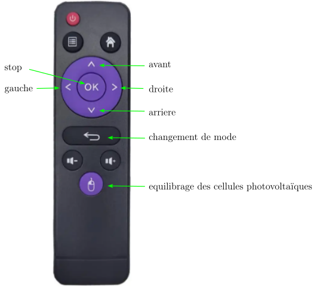

# Introduction

Voiture sans roues codeuses

# Liste de materiel:
- __ESP8266 mini D1__ : 
- __shield moteur L9110__ : 
- __diode IR TL1838 (ou équivalent)__: https://fr.aliexpress.com/item/4000610270256.html?spm=a2g0o.order_list.order_list_main.114.5f2c5e5bFkj0JY&gatewayAdapt=glo2fra

# Schema electrique partiel Fritzing

# Schema electrique KiCAd

## Compilation et chargement du firmware (IDE Arduino)
Dans le répertoire Arduino, créer un répertoire __robot__ et copier tous les fichiers ci-dessus (sauf les images .png). Il faut s'assurer que l'esp8266 est reconnu par l'IDE. 

Si ce n'est pas le cas:
- dans le fichier __preferences__, ajouter le lien http://arduino.esp8266.com/stable/package_esp8266com_index.json à la liste des cartes additionnelles,
- dans le menu __Gestionnaire de Cartes__ (sous l'onglet __Outils__), rechercher ESP8266 et charger la librairie correspondante.

Avant de lancer la compilation, selectionner la carte __NodeMCU 0.9__ (ou (1.0). Il est à priori possible de choisir __Generic ESP8266 Module__ (non testé) mais dans ce cas, les pins D0,... D8 ne seront pas définies et il faut les remplacer par les numéros de GPIO correspondants dans les fichiers .ino, et .h (D0=16, D1=4, ...).

## Fonctionnement

Utiliser les touches de direction pour faire avancer le robot

# Autres robots

https://github.com/arnaudrco/visio/wiki/Robots
